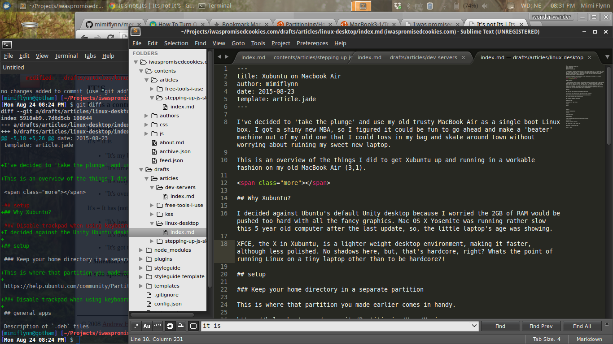
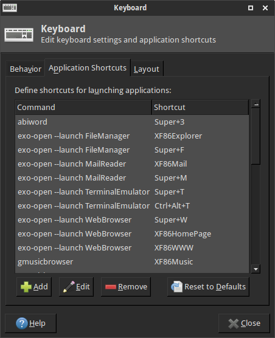
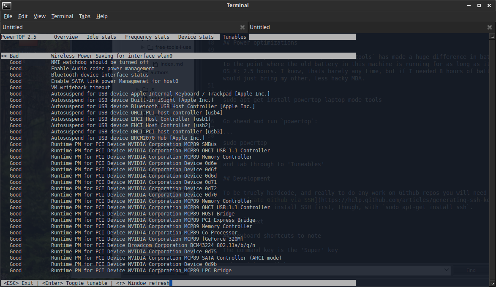

I've decided to 'take the plunge' and use my old trusty MacBook Air as a single boot Linux box. I got a shiny new MBA, so I figured it could be fun to go ahead and make a 'beater' machine out of my old one that I could toss in my bag and skate around town without worrying about ruining my sweet new laptop.

This is an overview of the things I did to get Xubuntu up and running in a workable fashion on my old MacBook Air (3,1).

<span class="more"></span>

## Why Xubuntu?

I decided against Ubuntu's default Unity desktop because I worried the 2GB of RAM would be pushed too hard with all the fancy graphics. Mac OS X Yosemite was running rather slow this 5 year old computer after the last update, so, the little laptop's age was showing.

XFCE, the X in Xubuntu, is a lighter weight desktop environment, making it faster, although less polished. No shadows here, but, that's hardcore, right? Whats the point of running Linux on a tiny laptop other than to be hardcore?!

## Setup

### Install

Before installing, make 2 partitions: one for your personal files and one for the operating system. I made my personal file partition larger than the OS partition because I know thats where the bulk of all the things will go. Do what you will, but make your choice wisely because if you want to resize it all later, you might just b0rk your machine.

Anyway, make a bootable USB drive with [Xubuntu](http://xubuntu.org/). I use [UNetbootin](https://unetbootin.github.io/). Just follow the directions and everything should be okay. I use the LTS (Long Term Support) version of the OS (at time of writing, 14.04) because, in my experience, its the most stable. Ubuntu comes out with an LTS every two years and they are pretty solid. If you want to be extra bonus hardcore, you can install the bleeding edge version, but beware that it might cause you more trouble than its worth.

Luckily, with an old MBA and its limited hardware configurations, you don't much have to  worry about some obscure piece of hardware not being supported. If its a newer MBA, you might have to worry a little more... if its the newest you might should just expect something to now work... and if you're using a computer that you made yourself, you might also should have a doomed feeling.

But, really, its all supposed to be 'for fun'.

Ubuntu has a whole section of its [https://wiki.ubuntu.com/MactelSupportTeam/CommunityHelpPages](wiki to cover 'Mactel' things) so check it out before going much farther.

Anyway, make the USB boot drive and turn off the laptop. Restart it while holding down the `option` key and it should show you a fancy screen with your Macintosh HD as two drives and a bootable USB drive. Pick the USB drive... unless you want to got back to OS X, which you don't because you are trying to install Linux.

You *should* get a screen that asks if you want to install Linux or try it out. Do what you want, but when you decide to install, select install and follow all the directions. At some point very soon to the beginning, it will ask what you want to do with all your partitions. Pick the partition you want to install the OS onto and move on.

### Keep your /home directory in a separate partition

This is where that partition you made earlier comes in handy. Keeping your /home directory in a separate partition means you can re-install the OS if you happen to break anything and not have to worry about your personal configuration files and other such important things. It'll all be there, waiting for that bleeding edge version of Xubuntu to greet it upon login.

[Follow these directions super carefully](https://help.ubuntu.com/community/Partitioning/Home/Moving)

### Disable trackpad when using keyboard

When using OS X, you've never had to worry about losing cursor focus due to a slight brush of your palm on the trackpad. That's quality. Xubuntu is free software that allows a user to configure it all they want, which means you have to think about things like this.

But, as free software that anyone can work on, some brilliant dev somewhere was plagued with this trackpad typing focus bug and created a fix.


Go to the 'Whisker Menu' (the little mouse at the top left side of the screen), click on 'Settings' to the bottom-ish right of the menu, and then select 'Mouse and Touchpad'. Look over the 'Buttons and Feedback' tab and tweak as you want, then select the 'Touchpad' tab and check 'Disable touchpad while typing'. Overtime, you might need to adjust the 'Duration' until it feels right to you.

### Keyboard shortcuts



The command key is the 'Super' key

option+tab - switch open apps

super-r - open

All keyboard shortcuts are customizable via the Keyboard section of Settings (in the Whisker menu like above, OR just hit Super+r and type in 'keyboard'). Hit '+add' to make a new shortcut, or 'edit' to change an existing one, or 'delete' if you hate one. When addng, it will prompt you to type in the command you want it to run. (What is this?! What does it mean?! How are you supposed to know what commands are available?!) Enter the command you want and hit 'OK' and it will ask you to hit the keyboard shortcut combo you want to use to run that command. Easy peasy.

### XFCE theme manager

You can make Xubuntu look awesome, or horrible, its all up to you.

http://www.webupd8.org/2013/06/xfce-theme-manager-single-gui-to-change.html

## Applications

Description of `.deb` files

dropbox

chrome

synaptic

## Power optimizations



Installing `powertop` and `laptop-mode-tools` has made a huge difference in battery life, to the point where the old battery in this machine is running for as long as it did with OS X: 2.5 hours. I know, thats barely any time, but if I needed 8 hours of battery life, I would just bring my other, less hacky MBA.

```
sudo apt-get install powertop laptop-mode-tools
```

Go ahead and run `powertop`:

```
sudo powertop
```

and tab through to 'Tunables'

## Development

To be truely hardcore, and really to do any work on Github repos you will need to [authenticate Github via SSH](https://help.github.com/articles/generating-ssh-keys/). You'll need to install SSH first, though, with `sudo apt-get install ssh`.

sublime text 

## References

[XFCE Theme Manager - Web Upd8](http://www.webupd8.org/2013/06/xfce-theme-manager-single-gui-to-change.html)